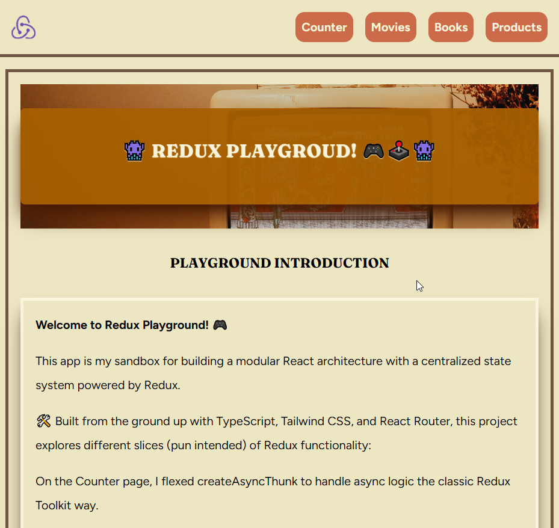
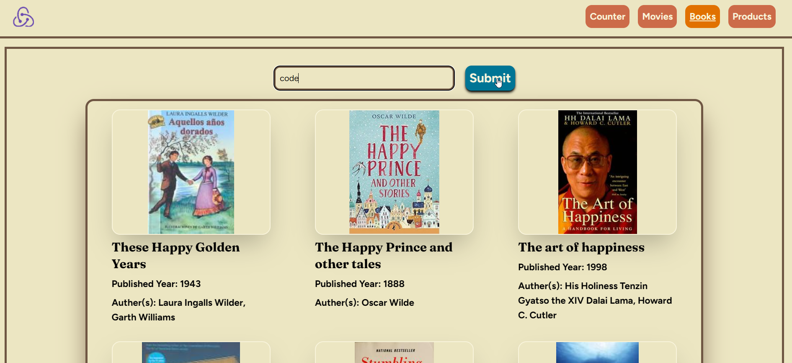
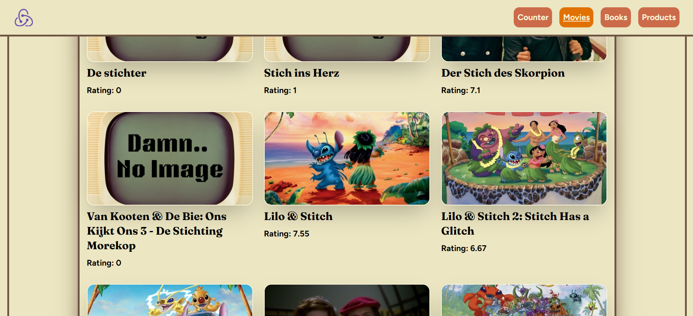
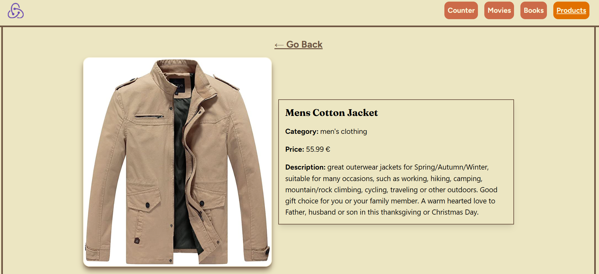

# Redux Playground

> A versatile and interactive web playground built with **React**, **TypeScript**, **Tailwind CSS**, **Redux Toolkit**, **React Router**, and **Async Thunks**.

## Table of contents

- [Redux Playground](#redux-playground)
  - [Table of contents](#table-of-contents)
  - [General info](#general-info)
  - [Screenshots](#screenshots)
  - [Tech Stack](#tech-stack)
  - [Code Examples](#code-examples)
  - [Goals](#goals)
  - [Features](#features)
  - [To-do list](#to-do-list)
  - [Status](#status)
  - [Contact](#contact)

## General info

**Redux Playground** is a modular and minimalistic React application built to explore and demonstrate core concepts of **Redux Toolkit**, **Async Thunks**, and **component-based architecture** using **React + TypeScript**.

The project consists of four parts:

1. **Counter** – A simple counter app with custom amount input and async update.
2. **Movies** – Search and view movies using a keyword.
3. **Books** – Search and view books using a keyword.
4. **Products** – Browse and filter products by category.

Users can view detailed information by clicking on any movie, book, or product item.

## Screenshots






## Tech Stack

- **React**
- **TypeScript**
- **Tailwind CSS**
- **Redux Toolkit**
- **createAsyncThunk**
- **React Router**
- **Visual Studio Code**
- External APIs for movies, books, and products

## Code Examples

```ts
export const movieApi = createApi({
  reducerPath: 'movieApi',
  baseQuery: fetchBaseQuery({
    baseUrl: `${import.meta.env.VITE_MOVIE_URL}`
  }),
  tagTypes: [],
  endpoints: (build) => ({
    movieList: build.query<MovieList, string>({
      query: (searchTerm) =>
        `search/movie?api_key=${import.meta.env.VITE_API_KEY}&query=${searchTerm}`
    }),
    movieDetail: build.query<MovieType, string>({
      query: (id) => `movie/${id}?api_key=${import.meta.env.VITE_API_KEY}`
    })
  })
});
```

## Goals

- Modularised app using Redux Toolkit with multiple APIs (movies, books, products)
- Deepen understanding of createSlice, createAsyncThunk
- Practice TypeScript in a full React + Redux workflow

## Features

- Counter with custom increment and async update
- Movie search and detail page
- Book search and detail page
- Product browsing with category filter

## To-do list

- Add favorites (like/watchlist functionality)
- Implement user authentication
- Add cart system for products

## Status

Project is: ✅ Version 1 completed

## Contact

By [boba-milktea](https://github.com/boba-milktea)
